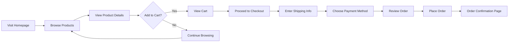
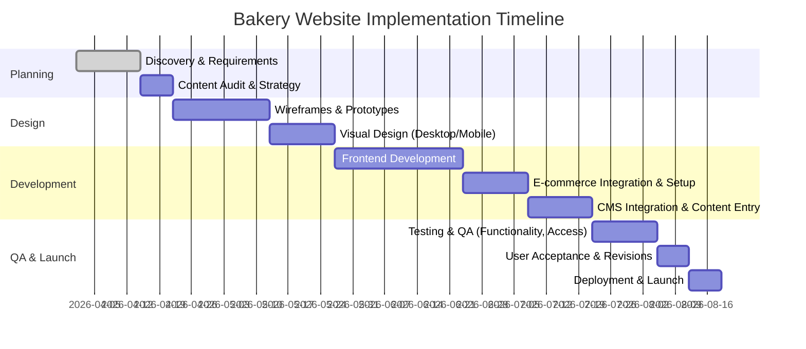

# Executive Summary  
A high-end **bakery website** should feel as fresh and inviting online as a bakery does in real life. Its primary audience is retail consumers – often busy local shoppers (many aged 18–35) seeking convenience, freshness, and specialty items【5†L69-L77】【5†L93-L97】. Key content includes clear **product menus/pages** (with pricing and ingredients/allergens), an engaging **About/Story**, **location/hours**, and e‑commerce features (online ordering, delivery/pickup info, subscriptions, gift cards). Visual design should use warm, appetizing imagery and consistent branding (cohesive color palette, typography, and iconography) to convey quality and trust. For example, themes can range from **“Rustic Artisan”** (earthy browns, hand-crafted fonts, overhead bread photos) to **“Playful Pastel”** (soft pinks, whimsical script, playful pastries) to **“Modern Minimalist”** (muted neutrals, clean sans‑serifs, sleek product shots). 

Effective UI/UX patterns include a prominent **hero section** (large product image or slideshow with a clear CTA), intuitive **navigation** (top menu, mega-menu or hamburger on mobile), clear **product listing grids** (with category filters and search), and detailed **product pages** (images, description, ingredients/allergens, price, and Add‑to‑Cart). A smooth **cart/checkout** flow with progress indicators, user account pages (order history), and accessible mobile navigation (sticky headers or bottom nav) is essential. Microinteractions (e.g. hover effects on buttons, add‑to‑cart animations) can add delight.

On the technical side, modern frontend stacks like **React (Next.js)**, **Vue (Nuxt)**, or **SvelteKit** are popular. React/Next offers strong SEO support and a large ecosystem【30†L142-L151】; Vue/Nuxt is another robust option; SvelteKit can yield lighter bundles for high performance. Component libraries (Material UI, Chakra UI, Vuetify, Tailwind UI) accelerate development, and CSS strategies can range from utility-first (Tailwind CSS) to CSS-in-JS (Styled Components) or preprocessed/SASS with BEM. Many sites use headless CMS (e.g. Contentful, Sanity, Strapi or even WordPress headless) to manage content. Performance best practices – fast hosting (Vercel/Netlify), global CDN, image optimization, and minification – will ensure quick load times. SEO tactics include semantic HTML, meta tags, schema (e.g. Menu or Product schema), alt text on images, and a mobile-friendly design【35†L121-L125】【20†L829-L832】. Analytics (Google Analytics 4, Hotjar, etc.) and integrations (Shopify/WooCommerce for store, Stripe/PayPal/Razorpay for payments) round out the architecture.

**Implementation** will follow a structured roadmap (Discovery → Design → Development → Testing → Launch). A typical timeline might be 3–6 months. Estimated effort varies: a simple template-based site could be ~100–200 man-hours (₹2–4 lakhs), a medium-custom site ~400–600 hours (₹5–12 lakhs), and a fully custom enterprise site ~1000+ hours (₹15+ lakhs)【44†L127-L136】【44†L108-L112】. Phases include user research & content planning, wireframing & mockups, frontend/back-end coding, content population, and thorough QA (functional, cross-browser, responsive, accessibility) before deployment.  

The following sections delve into examples, design concepts, technical recommendations, checklists, and deliverable templates to guide the creation of a polished, high-converting bakery website.

## Top Bakery Site Examples: Comparison Table  

| Bakery (URL)                  | Platform / Tech          | Standout UI Features                                                                   | Why It Works (Key Takeaways)                              |
|-------------------------------|--------------------------|-----------------------------------------------------------------------------------------|-----------------------------------------------------------|
| **Debaere Bakery**<br>_debaere.co.uk_【1†L108-L112】    | Squarespace          | Warm, moody food photography; vintage serif typography; clear “Pure Joy, Baked In” hero.<br>Whitespace and clean layout with social proof (videos, press). | Feels indulgent and trustworthy. The rich photos and classic fonts convey artisanal quality, while a prominent tagline reinforces brand promise【1†L108-L112】.  |
| **Honeybear Bake Shop**<br>_honeybearbakeshop.com_【1†L119-L122】 | Squarespace          | Bright pastel-pink palette; playful curves and wavy dividers; bold product photos.<br>Fun copy (“Cookie Monsters”) and clear “How to Order” CTA. | Feels friendly and fun. The cohesive pink theme and whimsical shapes match its sweet treats, and visible awards/testimonials build trust【1†L119-L122】.  |
| **TOAD Bakery**<br>_toadbakery.com_【1†L130-L133】     | Squarespace          | Minimalist grid layout; high-quality flatlay product photos; strong sans-serif typography; ample white space. | Clean, modern aesthetic. By stripping away clichés and focusing on sleek imagery and clear pricing, the site feels sophisticated and trustworthy【1†L130-L133】. |
| **Crust Vegan Bakery**<br>_crustveganbakery.com_【1†L141-L144】 | Squarespace          | Earthy terracotta color scheme; clear, modern typography; custom “storefront” illustration in hero.<br>Photo gallery section showcasing community events. | Warm, community-driven feel. The color palette and personal photos highlight its artisanal, local brand image【1†L141-L144】. Clear nav and images guide users to order. |
| **Magnolia Bakery**<br>_magnoliabakery.com_【1†L152-L155】 | Shopify             | Classic pastel blocks (yellow/pink) and bakery photography; organized product category sections.<br>Prominent hero slider and multiple CTAs (“Order Now”). | Polished e-commerce layout. The pastel branding feels inviting, and logical navigation & CTAs make shopping intuitive【1†L152-L155】. Use of real product photos and clear categories drives sales. |
| **Grand Central Bakery**<br>_grandcentralbakery.com_【1†L163-L166】 | Squarespace          | Documentary-style bakery photography; split-screen sections showing products vs. people.<br>Natural color palette (greens/browns); logos of press features as social proof. | Story-driven design. By highlighting its community mission and behind-the-scenes images, it builds authenticity and emotional connection【1†L163-L166】. |
| **Janjou Patisserie**<br>_janjou.com_【1†L174-L177】    | Squarespace          | Full-screen, high-resolution pastry images on homepage; very minimal navigation (hidden menu).<br>Elegant, understated color scheme. | Gallery-like showcase. The minimalist approach lets the crafts stand out, creating a luxury “art gallery” experience for visitors【1†L174-L177】. |
| **Wonder Bread**<br>_wonderbread.com_【1†L183-L186】  | Squarespace          | Bright, playful layout with circular motifs; strong product shots of sandwiches; simple top nav. | Fun and functional. The design echoes the brand’s iconic retro vibe. Bold circles and clean layouts highlight products and uses (e.g. “Make it a meal”), emphasizing versatility【1†L183-L186】.  |

Each example illustrates design principles that work for bakeries: high-quality food imagery, clear calls to action, and a cohesive visual theme matching brand identity【25†L335-L344】【25†L345-L354】. The table above cites sources that describe their key design elements and why visitors trust them【1†L108-L112】【1†L119-L122】. Platforms range from hosted builders (Squarespace, Shopify) to more custom solutions, but the user experience focus is universal.

## Three Theme Concepts  

1. **Rustic Artisan** – *Palette:* Warm earth tones (terracotta #D2691E, cream #F5F5DC, sage green #8A9A5B). *Fonts:* A pairing of a hand-script or serif headline (e.g. Playfair Display, or a custom brush script) with a clean sans-serif (e.g. Lato) for body text. *Sample Hero:* Full-bleed photo of a wood-fired sourdough loaf on a rustic table, overlaid with a translucent cream overlay. Text “Fresh Baked Goodness, Every Day” in a warm serif, and a prominent “Shop Now” button. *Target Customer:* Urban foodies and farm-to-table enthusiasts who value artisanal quality and simple natural ingredients. This theme emphasizes authenticity and craftsmanship – ideal for a boutique bread bakery or artisanal patisserie.  

2. **Playful Pastel** – *Palette:* Soft pastels (cotton candy pink #FFC0CB, mint green #AAF0D1, lemon yellow #FFFACD) with bright accent (e.g. vibrant coral #FF6F61). *Fonts:* Whimsical script or rounded display font (e.g. Pacifico) for headings, paired with a friendly sans-serif (e.g. Montserrat) for body text. *Sample Hero:* A carousel slideshow of cheerful dessert images (cupcakes, macarons) with playful hand-drawn doodles or icons. Headline reads “Sweeten Your Day” in a pastel script, with colorful buttons like “Order Cupcakes” in accent colors. *Target Customer:* Young families and social-media-savvy customers looking for custom cakes and treats. This theme conveys fun and creativity, perfect for a cake shop or cupcake bakery.  

3. **Modern Minimalist** – *Palette:* Monochrome neutrals (white, charcoal #333333, light gray #EEEEEE) with one bold accent color (e.g. mustard #E1AD01 or teal #008080). *Fonts:* Sleek geometric sans-serifs (e.g. Proxima Nova for headers, Open Sans for text). *Sample Hero:* A clean, grid-based hero with alternating image/text cards. For example, left panel: high-res image of a single croissant on white, right panel: “Handcrafted Pastries” text and a “Shop Now” CTA. The overall page has lots of whitespace and simple iconography (e.g. line-icon of a leaf to denote organic). *Target Customer:* Trend-conscious urbanites and corporate clients. This style appeals to modern coffee shops or bakery-café hybrids, focusing on efficiency and a premium feel.  

Each theme concept balances color and typography to set a mood (warm vs playful vs sleek) and includes a hero layout suggestion to demonstrate how the brand message and CTA would appear. These concepts guide the site’s **visual direction**, ensuring consistency from homepage to checkout.

## Recommended Frontend Stack (Options & Trade-offs)  

- **React + Next.js** – *Pros:* Excellent SEO (supports SSR/SSG), very popular (huge community and ecosystem), flexible for complex UIs, good for headless CMS integration【30†L142-L151】. *Cons:* Steeper learning curve, more build/config setup; potential performance overhead if not optimized.  
- **Vue + Nuxt.js** – *Pros:* Similar benefits to Next but in Vue ecosystem (progressive integration, easy state management), strong SEO support. *Cons:* Slightly smaller ecosystem than React; might be less familiar to some dev teams.  
- **SvelteKit** – *Pros:* Compiles to very lean JS for high performance, built‑in SSR/SSG; modern and simple syntax. *Cons:* Smaller ecosystem and newer (fewer off-the-shelf components); fewer developers available compared to React.  

**Component Libraries/CSS:** Use a UI library for speed: e.g. Material UI or Chakra UI for React, Vuetify or Quasar for Vue, or standalone CSS frameworks like **Tailwind CSS** (utility-first) for any. Tailwind (with its JIT compiler) produces minimal final CSS and enforces consistency. For styles, alternatives include SASS/SCSS with BEM convention or CSS Modules for scoped styles. 

**Headless CMS:** For content like menus, blog, and pages, consider Contentful, Sanity.io, Strapi, or even WordPress in headless mode. These allow non-devs to edit pages and products. A headless CMS plus static or SSR frontend (Next/Nuxt) gives maximum performance and security. If preferring an all-in-one, Shopify (with its Storefront API) can handle products/orders while letting you build a custom frontend (e.g. Next/Shopify Hydrogen) for ultimate flexibility.  

**E-commerce Integration:** Popular options:
- **Shopify** – handles product catalog, cart, checkout, payments. Pros: robust, PCI-compliant, easy scalability; Cons: monthly fees, transaction fees, less flexible customization without custom apps【44†L129-L137】.  
- **WooCommerce (WordPress)** – open-source plugin with full e-commerce features. Pros: cost-effective, flexible, huge plugin ecosystem; Cons: can be heavy to maintain, requires own hosting, security patches【44†L127-L136】.  
- **Stripe/Payment Gateways:** Regardless of platform, integrate Stripe (or Razorpay/PayPal for Indian market) for credit cards/UPI. These provide secure hosted checkout flows.  

Each stack choice should weigh the team’s familiarity and the bakery’s needs (e.g. simple site vs complex ordering). React/Next or Vue/Nuxt are future-proof and excellent for performance/SEO, while a mature hosted CMS/e-store like Shopify or WordPress/WooCommerce provides built-in features to speed up development.

## Responsive Wireframes & User Flow (Mermaid Diagrams)  

**Homepage Wireframe (mobile view):**  
```
+-----------------------------+
| [Logo]   [Menu]   [Cart](🔲)|
+-----------------------------+
| [HERO IMAGE: Fresh Bread]   |
|  "Welcome to [Bakery]"      |
|  [Order Now] [Learn More]   |
+-----------------------------+
| [Feature: Daily Specials]   |
| [Grid: Top Categories]      |
| - Breads | Pastries | Cakes |
+-----------------------------+
| [Featured Products Grid]    |
| [Image] [Image] [Image]     |
| [Name]  [Name]  [Name]      |
+-----------------------------+
| [Instagram Gallery]         |
+-----------------------------+
| [Footer: Hours, Contact, FAQ]|
+-----------------------------+
```  

**Product Listing Wireframe (tablet/desktop):** Categories on left filter pane (e.g. checkboxes for “gluten-free,” search bar), product grid on right with images, names, short description, price, and “Add to Cart” buttons under each. Hovering on a product shows quick “View Details” overlay. 

**User Flow: Browse → Cart → Checkout:** (Mermaid flowchart)



This flow ensures the user can browse categories, view details (with ingredients/allergens info), add items, and then smoothly progress through checkout with form fields for address/payment. A progress bar during checkout (e.g. steps “Shipping → Payment → Confirmation”) is recommended for clarity.

## SEO & Accessibility Checklist  

- **Meta Tags & Structure:** Unique `<title>` and `<meta description>` for each page; logical headings (H1, H2…) reflecting content hierarchy. Use bakery-related keywords (e.g. “artisanal bread in [City]”) naturally in copy【35†L112-L121】.  
- **Local SEO:** List full NAP (Name/Address/Phone) consistently; create/optimize Google Business Profile; include location schema and embedded Google Map【35†L119-L125】【35†L191-L200】.  
- **Image SEO:** Use high-quality images (optimized WebP/JPEG) at proper responsive sizes (e.g. hero image ~1200–1600px wide, product images ~800px). Always include descriptive `alt` text (e.g. “Chocolate chip cookie on a plate”) to improve accessibility and help SEO【20†L829-L832】. 
- **Content & Schema:** Implement structured data: *Menu* schema for menu pages, *Product* schema on product pages (name, price, availability, etc.), *FAQ* schema on FAQs. Use breadcrumb schema for product categories.  
- **Performance:** Use a CDN (e.g. Cloudflare, Fastly) and fast hosting (Vercel/Netlify/GCP). Leverage caching (browser cache, SSR/SSG) and lazy-load images. Aim for Google Lighthouse scores (Performance, Accessibility, Best Practices, SEO) ≥90. 
- **Accessibility:** Ensure WCAG 2.1 AA compliance:  
  - **Color Contrast:** Text and background meet 4.5:1 contrast.  
  - **Keyboard Nav:** All interactive elements (menus, buttons, forms) operable via Tab key.  
  - **ARIA & Labels:** Use `aria-label` for icons/buttons (e.g. cart icon), label all form inputs (for checkout).  
  - **Alt Text:** See above.  
  - **Semantic HTML:** Use `<button>` elements, proper form tags, `<nav>`, `<header>`, `<main>`, `<footer>`, etc.  
- **Mobile Friendliness:** Responsive layout for all device widths; touch-friendly buttons; viewport meta tag. Google’s Mobile-Friendly Test should pass【35†L121-L125】.  

Regularly run audits (Lighthouse, WAVE) during development to catch issues early.

## Content & Assets Checklist  

- **Photography:** Professional shots of each product. Recommended: 2–3 per item (wide, close-up, styled scene). *Sizes:* Hero/background ~1200–1600px width; gallery/product images ~800px; thumbnails ~400px. Use WebP/optimized JPEG. Each image needs distinct, descriptive **alt text**.  
- **Iconography:** Consistent icon set for things like “Delivery”, “Pickup”, “Gluten-Free”, etc. Use SVG icons (accessible and scalable).  
- **Copy Examples (10 sample products):**

  1. **Classic Sourdough Loaf** – “Our signature sourdough with a tangy crust and chewy interior. Made with organic flour and natural starter. *Allergens:* Wheat. Price: ₹150.” *Alt:* “Round sourdough loaf on cutting board.”  
  2. **Almond Croissant** – “Buttery, flaky croissant filled with almond cream and topped with toasted almonds. *Allergens:* Wheat, nuts, eggs. Price: ₹120.” *Alt:* “Cut open almond croissant showing almond filling.”  
  3. **Chocolate Ganache Cake (Half)** – “Rich chocolate sponge layered with velvety ganache. Serves 6–8. *Allergens:* Dairy, wheat. Price: ₹800.” *Alt:* “Chocolate cake slice with ganache filling.”  
  4. **Rose Macaron Box (12pcs)** – “Assorted macarons in rose, pistachio, and mango, hand-rolled for delicate flavors. *Allergens:* Nuts, eggs. Price: ₹600.” *Alt:* “Assorted colorful macarons in gift box.”  
  5. **Gluten-Free Brownie** – “Decadent fudgy brownie made with almond flour and dark chocolate. *Allergens:* Eggs, nuts. Price: ₹80.” *Alt:* “Square gluten-free brownie on plate.”  
  6. **Honey Oat Bread** – “Soft wholegrain loaf sweetened with local honey and topped with oats. *Allergens:* Wheat. Price: ₹180.” *Alt:* “Sliced honey oat bread loaf with oats on top.”  
  7. **Classic Butter Cookies** – “Selection of crisp, buttery shortbread cookies in festive shapes. *Allergens:* Dairy, wheat. Price: ₹300 (box of 20).” *Alt:* “Box of assorted butter cookies.”  
  8. **Vanilla Cupcake** – “Light vanilla sponge cupcake with a swirl of whipped frosting and sprinkle garnish. *Allergens:* Dairy, wheat. Price: ₹60.” *Alt:* “Vanilla cupcake with frosting and sprinkles.”  
  9. **Lavender Lemon Tart** – “Buttery crust filled with tangy lemon custard infused with lavender. *Allergens:* Dairy, wheat. Price: ₹120.” *Alt:* “Lemon tart dusted with lavender petals.”  
  10. **Birthday Cake (Customization)** – “Choose any flavor; write your message on a 1kg cake (serves ~10). *Allergens:* Varies by flavor. Price starts at ₹1200 (2 flavors), ₹1500 (3 flavors).” *Alt:* “Decorated birthday cake with candles.”  

  *Note:* Include ingredients/allergen list in product detail section for each (e.g., in tab or accordion on product page). Use consistent tone: descriptive but concise, highlighting freshness or unique qualities.

- **Other Assets:** Logo (vector/SVG), bakery photos (storefront, team), blog images (store events, new recipes), icons (social media, payment), favicon. Prepare all graphics in optimized web formats. 

## Implementation Roadmap & Cost Estimates  

Below is a sample Gantt chart outline. Adjust durations based on project scope:



**Milestones:** Requirements sign-off; Design approval; Beta release; Launch. Post-launch may include marketing (email/SEO) and minor fixes.

**Estimated Effort & Cost:** (indicative ranges)  
- **Low Complexity:** Template-based site, minimal customization. ~160–240 hours. Cost: ₹3–6 lakh (₹300k–₹600k) or ~$3–8k【44†L127-L136】【44†L107-L112】.  
- **Medium Complexity:** Custom designs, moderate product count, some integrations. ~400–600 hours. Cost: ₹6–12 lakh ($8–15k).  
- **High Complexity:** Full custom UI/UX, large product catalog, subscription features, multi-store (IN & international), advanced CMS/e-commerce. ~800+ hours. Cost: ₹15 lakh+ ($20k+).  

(Per [44], a small e-commerce site typically falls in $5k–25k【44†L107-L112】; final cost depends on geography, agency vs freelancer, and feature set.)

## Testing/QA Checklist  

- **Functionality:** All links/buttons work; forms validate and submit (contact form, order form); ordering process completes successfully (test adding items, checkout, payment).  
- **Responsive Layout:** Test on various screen sizes (mobile phones, tablets, desktops). Check navigation toggles, grid layouts, images scaling, and legibility at small widths.  
- **Cross-Browser:** Verify on latest Chrome, Firefox, Safari, and Edge. Ensure no layout breaks or JS errors.  
- **Accessibility:** Verify with a screen reader (VoiceOver, NVDA) that navigation and form fields are labeled; all content readable. Use accessibility linting (axe, Lighthouse). Check color contrast ratios. Ensure `alt` text on images is present.  
- **Performance:** Run Google Lighthouse audit. Optimize any slow-loading pages (e.g. heavy images or unminified code).  
- **SEO:** Check robots.txt and sitemap.xml. Ensure title/meta tags are set. Verify structured data (use Google’s Rich Results Test).  
- **Security/Compliance:** SSL certificate installed; payment pages secure. Check for common vulnerabilities (e.g. SQL injection if relevant, though using hosted platforms mitigates this).  
- **Content Accuracy:** Proofread all text; ensure hours/locations are correct; test coupon codes or subscriptions if applicable.  
- **Backup & Recovery:** (If self-hosted) Ensure code is in version control (Git), database backups in place.  
- **Analytics:** Verify that Google Analytics (or chosen tool) is recording pageviews and e-commerce events correctly before going live.  

A checklist should be used by developers and QA to systematically verify each point.

